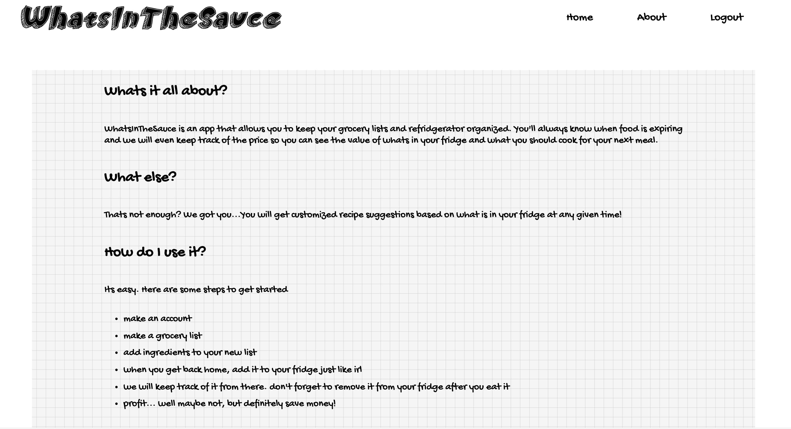
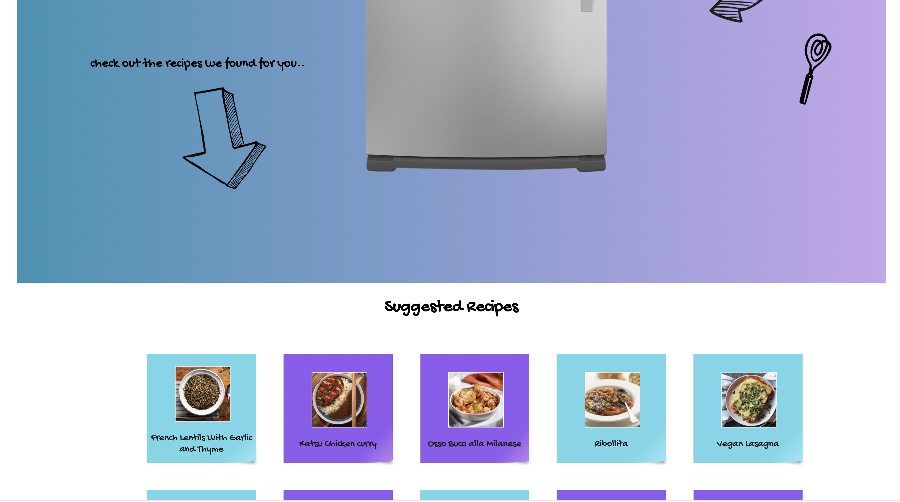
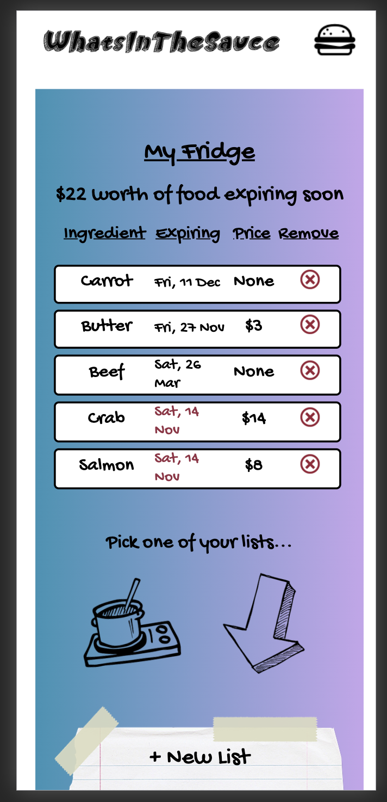

# Whatsinthesauce
*By Jaron Degen - [Visit WhatsInTheSauce](https://whatsinthesauce.herokuapp.com/)*
- Grocery List and Fridge Tracker 
**Table of Contents**
* [WhatsInTheSauce at a Glance](#rappamappa-at-a-glance)
* [Application Architecture & Technologies Used](#application-architecture) 
* [Frontend Overview](#frontend-overview)
* [Backend Overview](#backend-overview)
* [Conclusion & Next Steps](#conclusion-and-next-steps)

## WhatsInTheSauce at a Glance
WhatsInTheSauce is a fullstack app that allows users to create and actively use multiple grocery lists and then transfering ingredients from those lists into thier "fridge" just like irl. Users can then view what days those ingredients will expire and thier value along with suggested recipes based on what is in the fridge so users will always know what to make for thier next meal.

##### RappaMappa at a glance

WhatsInTheSauce uses [The Meal](https://www.themealdb.com/) DB API to allow users to get real time custom recipe recommendations based on ingredients they have put into their fridge

WhatsInTheSauce is also optimized for mobile using CSS media queries and conditional React components

# User Stories
----------------

- [ ] As a user I want to be able to build a grocery list before going to the market

- [ ] From this grocery list I would like to be able to remove and add items or add them to my "fridge"

- [ ] As a user I want to be able to see what is in my fridge and when things might go bad and the dollar value from the main page/dashboard
    - I would like my fridge list to be organized by food group
    - Pictures and prices of the food would be helpful

- [ ] As a user I would like to get recommendations for things to do with ingredients that may go bad soon
    - Link to whatsforlunch

# MVP
------
- [ ] shopping lists (add/delete/move items)
- [ ] fridge inventory 
- [ ] dashboard with prices and pictures and expiration dates
- [ ] login/signup/auth

# Stretch Goals
---------------
- [ ] recipe recommendations
- [ ] mobile view support
- [ ] share what’s in your fridge with other users
- [ ] nutritional info

# Data Base
-------------

- users
---------------------
    - id
    - username
    - email
    - hashed_password

- food_groups
---------------------
    - id
    - name

- ingredients
---------------------
    - id
    - name
    - expires_in
    - food_group_id

- ingredient_shopping_list (join)
-----------------------------------
    - list_id
    - ingredient_id

- shopping_lists
----------------------
    - id
    - indgredient_id
    - user_id
    - name (user_id + string)

- ingredient_fridge (join)
---------------------------
    - ingredient_id
    - user_id
    - price (nullable)

- recommendations
--------------------
    - id
    - ingredient_id
    - recommendation
    - recipe_url (nullable)

# Routes
----------
- `/` redirects to dashboard or login depending on authorization
- `/login` login/signup page
- `/home` user dashboard with fridge list and links to shopping lists
- `/shopping/new` create a new list page
- `/shopping/:id` interactive individual shopping list page
- `/profile` edit profile page with change password/email/username
- `/ingredients/:id` ingredient page with recommendations and info

