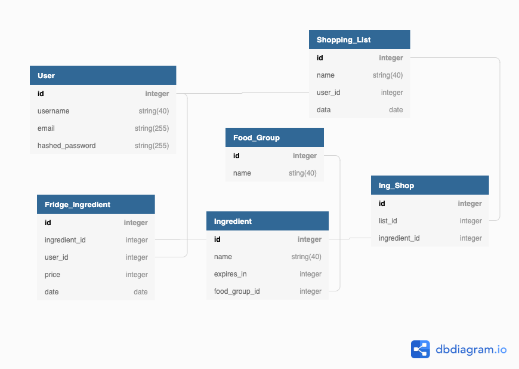

# Whatsinthesauce
*By Jaron Degen - [Check out WhatsInTheSauce](https://whatsinthesauce.herokuapp.com/)*
- Grocery List and Fridge Tracker 

**Table of Contents**

* [WhatsInTheSauce at a Glance](#WhatsInTheSauce-at-a-glance)
* [Application Architecture & Technologies Used](#application-architecture) 
* [Backend Overview](#backend-overview)
* [Frontend Overview](#frontend-overview)
* [Security & Authorization](#security-&-authorization)
* [Conclusion & Future Features](#conclusion-&-future-features)

## WhatsInTheSauce at a Glance
WhatsInTheSauce is a full-stack web app that allows users to create and actively use multiple grocery lists and then transfering ingredients from those lists into thier "fridge" just like irl. Users can then view what days those ingredients will expire and thier value along with suggested recipes based on what is in the fridge so users will always know what to make for thier next meal.

##### WhatsInTheSauce at a glance


WhatsInTheSauce uses [The Meal DB](https://www.themealdb.com/) DB API to allow users to get real time custom recipe recommendations based on ingredients they have put into their fridge


WhatsInTheSauce is also optimized for mobile using CSS media queries and conditional React components


#### Application Architecture
WhatsInTheSauce is a full stack application and starts with the database in the backend built with [Flask SQLAlchemy](https://flask-sqlalchemy.palletsprojects.com/en/2.x/), [Flask-Migrate](https://flask-migrate.readthedocs.io/en/latest/), using a [Postgress](https://www.postgresql.org/) database.



## Backend Overview
All data is fetched from the [Flask](https://flask.palletsprojects.com/en/1.1.x/) server including queries to the database as well as GET requests to [The Meal DB](https://www.themealdb.com/) API and then stored in throughout multiple layers of the [Redux](https://redux.js.org/) store.  This gives users quicker load times since data is only retireved as necessary or when something in the user's fridge changes.
Only data needed is retrieved, for example, since youtube links to the suggested recipes require a GET request to [The Meal DB](https://www.themealdb.com/) API, that request will only happen when a user actually clicks the link saving memory and increasing efficiency.  


## Frontend Overview

As stated before [React](https://reactjs.org/) is used and is at the core of application logic and frontend architecture.  Many built-in React 
[Hooks](https://reactjs.org/docs/hooks-intro.html) are used to aid in passing data around throughout components as well as [Redux](https://redux.js.org/) and Redux [Hooks](https://react-redux.js.org/api/hooks) and [Redux Thunk](https://www.npmjs.com/package/redux-thunk) and regular props. All of the design and animation is done with vanilla [CSS](https://developer.mozilla.org/en-US/docs/Web/CSS) and makes use of conditionals in [React](https://reactjs.org/) based on window width paird with media queries in [CSS](https://developer.mozilla.org/en-US/docs/Web/CSS) to track a max-width of 900 pixels.  

```css
@media screen and (max-width: 900px) {
    .navbar-link {
        display: none; 
    }

    .narbar-middle {
        display: none;
    }

    .navbar-container {
        width: 100%;
        display: grid;
        grid-template-columns: 70%, 30;
    }
    
    .mobile {
        display: block;
    }

    .hamburger-div {
        display: flex;
        margin-right: 5%;
        align-items: flex-start;
    }

    #burge {
        width: 80%;
    }

    .navbar-logo {
        width: 100%;
        margin-left: 20%;
        margin-top: 2%;
    }

    .narbar-left {
        grid-column: 1/3;
    }

    .narbar-right {
        grid-column: 3/4;
        display: flex;
        justify-content: flex-end;
        align-items: center;
    }

    .mobile-navbar-links-div {
        width: 100vw;
        height: 100%
    }
    
    .mobile-nav-container {
        font-family: 'Gochi Hand', cursive;
        width: 100%;
        height: 75px;
        display: flex;
        justify-content: center;
        align-items: center;
        border: 1px solid lightgray;
        font-size: 2rem;
        transition: all .4s ease-in-out;
        background-color: rgb(238, 238, 238);
    }
    
    .mobile-nav-container:hover {
        background-color: lightgray;
        transform: scale(1.1)
    }
}
```

## Security & Authorization
[Flask-Login](https://flask-login.readthedocs.io/en/latest/) is utilized for setting users login sessions in the backend, [Werkzeug](https://werkzeug.palletsprojects.com/en/1.0.x/) for generating and checking hashed passwords, and [Flask-WTF](https://flask-wtf.readthedocs.io/en/stable/) is used for CSRF Protection for all form data sent to and from the [Flask](https://flask.palletsprojects.com/en/1.1.x/) server which is all written in [Python](https://www.python.org/).

```py
import os
from flask import Flask, request, session
from flask_cors import CORS
from flask_wtf.csrf import CSRFProtect, generate_csrf
from flask_migrate import Migrate
from flask_login import (
    LoginManager,
    current_user,
    login_user,
    logout_user,
    login_required
)

from starter_app.models import db, User
from starter_app.api.user_routes import user_routes
from starter_app.api.list_routes import list_routes
from starter_app.api.fridge_routes import fridge_routes

from starter_app.config import Config

app = Flask(__name__)

app.config.from_object(Config)
app.register_blueprint(user_routes, url_prefix='/api/users')
app.register_blueprint(list_routes, url_prefix='/api/lists')
app.register_blueprint(fridge_routes, url_prefix='/api/fridges')

db.init_app(app)

migrate = Migrate(app, db)
login_manager = LoginManager(app)

with app.app_context():
    db.create_all()

CSRFProtect(app)

CORS(app)
```

## Conclusion & Future Features

WhatsInTheSauce was a very fun project for me. I've spent 7 years as a professional chef and 15 years total in gastronomy so I have definitely seen more than my fair share of food waste and love the idea of helping others reduce thier food waste and eat more home cooked meals.  This was my 4th full stack project and can't wait for the next.  After building this app I feel much more confident with Flask and [Docker](https://www.docker.com/). For features that I plan for the future please keep reading and check out my stretch goals.

Thanks for checking out [WhatsInTheSauce](https://whatsinthesauce.herokuapp.com/)! 👨‍🍳

# User Stories

&check; As a user I want to be able to build a grocery list before going to the market

&check; From this grocery list I would like to be able to remove and add items or add them to my "fridge"

&check; As a user I want to be able to see what is in my fridge and when things might go bad and the dollar value from the main page/dashboard
    - I would like my fridge list to be organized by food group
    - Pictures and prices of the food would be helpful

&check; As a user I would like to get recommendations for things to do with ingredients that may go bad soon
    - Link to whatsforlunch


# MVP
&check; shopping lists (add/delete/move items)

&check; fridge inventory 

&check; dashboard with prices and pictures and expiration dates

&check; login/signup/auth

# Stretch Goals
&check; recipe recommendations

&check; mobile view support

&cross; share what’s in your fridge with other users

&cross; nutritional info


